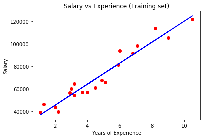
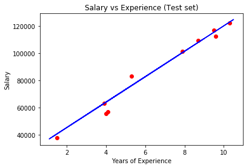

# Linear-Regression---Predict-the-salary-of-the-person-according-to-experience

This project focusses on predicting the salary of the person in accordance with the experience. 

Given the training dataset the model tries to fit in a line corrosponding to the data points (Salary  v/s Experience) using simple linear regression model.

The purpose of linear regression is to best fit a line which minimises the error between the given points and the predicted values

The provided Dataset consist of two columns 

1) Years of Experience
2) Salary of Indivisual in accordance to the experience

The dataset is divided into 80:20 ratio for the training and testing.

The training set is modelled(fit) using linear regression that is imported from sklearn library. the object LinearRegressor is called. 

After the model is trained, we try to predict using the remaining test points using the method LinearRegressor.predict. The  plot showing the training and testing part of the dataset after being fit by the model is shown in figure below

	

As we can see the model has been trained properly and the line was able to predict almost accuractely for the test dataset.

 
 
